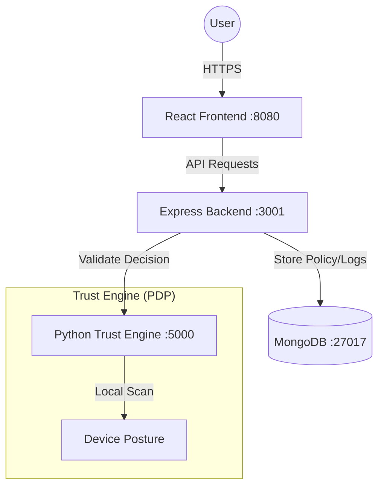

# SoraIAM - Zero Trust Identity and Access Management


**SoraIAM** is an enterprise-grade Zero Trust Identity and Access Management platform. It implements a "Never Trust, Always Verify" philosophy by combining real-time device posture scanning (Python Trust Engine) with context-aware access control (Node.js Backend).

---

## 🏗️ System Architecture

SoraIAM is composed of four primary services working in tandem:



---

## 📋 Table of Contents
- [Prerequisites](#-prerequisites)
- [Step 1: Installation](#step-1-installation)
- [Step 2: Configuration](#step-2-configuration)
- [Step 3: Running the Application](#step-3-running-the-application)
- [Step 4: Initializing Data](#step-4-initializing-data)
- [Step 5: Usage Walkthrough](#step-5-usage-walkthrough)
- [Docker Deployment (Easiest Method)](#-docker-deployment-easiest-method)
- [Project Structure](#-project-structure)

---

## 📦 Prerequisites

Ensure you have the following installed on your host machine:

- **Node.js** (v18+) & **npm** (v9+)
- **Python** (3.9+) & **pip**
- **MongoDB** (v6+) - Running locally or via Atlas
- **Docker & Docker Compose** (Optional, for containerized run)

---

## STEP 1: Installation

### 1. Clone the Repository
```bash
git clone https://github.com/SoraPewnaldo/Zero-trust.git
cd Zero-trust
```

### 2. Install Frontend Dependencies
```bash
npm install
```

### 3. Install Backend Dependencies
```bash
cd server
npm install
cd ..
```

### 4. Install Trust Engine Dependencies
```bash
cd trust_engine
pip install -r requirements.txt
cd ..
```

---

## STEP 2: Configuration

### Backend Env (`server/.env`)
Create a `.env` file in the `server` directory:
```bash
cd server
cp .env.example .env
```
Ensure `MONGODB_URI` points to your running database and `TRUST_ENGINE_URL` is set to `http://localhost:5000/scan`.

---

## STEP 3: Running the Application

### Option A: The "One-Command" Dev Mode
From the **root** directory:
```bash
npm run dev:all
```
*This starts the Frontend, Backend, and Trust Engine concurrently.*

### Option B: Individual Services (For Debugging)
- **Frontend**: `npm run dev` (Port 8080)
- **Backend**: `cd server && npm run dev` (Port 3001)
- **Trust Engine**: `cd trust_engine && python main.py` (Port 5000)

---

## STEP 4: Initializing Data

Before logging in, you must seed the database with the core Admin and Employee accounts:

```bash
cd server
npm run init-db
```
**Success Check**: You should see "Database initialized successfully" in the console.

---

## STEP 5: Usage Walkthrough

### 1. Admin Portal
- **URL**: `http://localhost:8080`
- **Login**: `sora` / `sora`
- **What to do**:
    - View the **Global Security Map** and real-time **Audit Logs**.
    - Go to **Access Policies** to define trust thresholds (e.g., "Production Console" needs 80+ score).
    - Manage **Employees** and their specific security context.

### 2. Employee Verification Scan
- **Login**: `sarah.johnson` / `password123`
- **What to do**:
    - Click **"Initiate Trust Scan"**.
    - The Backend calls the **Python Trust Engine** on your machine.
    - The Engine checks: **Firewall status, OS updates, and open ports**.
    - result: Your **Trust Score** is calculated and your session is either **Allowed**, **Blocked**, or flagged for **MFA**.

---

## 🐳 Docker Deployment (Easiest Method)

If you don't want to install Node/Python/Mongo individually, use Docker:

### 1. Launch all services
```bash
docker-compose up -d --build
```

### 2. Access
- **Application**: http://localhost (via Nginx proxy on Port 80)
- **Initialize DB (Internal)**:
  ```bash
  docker exec -it soraiam-backend npm run init-db
  ```

---

## 📁 Project Structure

- `src/`: React Frontend (Vite/TypeScript).
- `server/`: Express.js Backend (Trust score logic & DB management).
- `trust_engine/`: Python PDP (Osquery/Nmap scanning logic).
- `docker-compose.yml`: Multi-container orchestration logic.
- `nginx.conf`: Production-ready reverse proxy.

---

## 🔐 Security Features
- **Device Fingerprinting**: Scans the actual host for vulnerabilities before granting access.
- **Fail-Closed**: If the Trust Engine is offline, access is blocked by default.
- **JWT Protection**: All API routes (except Login) require valid bearer tokens.

---

**Author**: SoraPewnaldo  
            Aakhya Chhauhan
            Ritik Arora
            Jivaj Arora
**Support**: For issues, open a ticket at [GitHub Issues](https://github.com/SoraPewnaldo/Zero-trust/issues)
