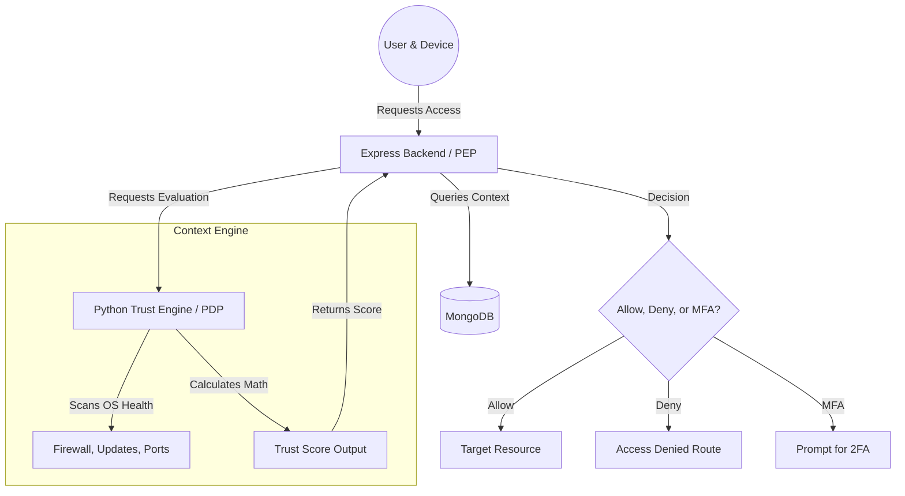

# Capstone Project: ZeroIAM (Zero Trust Architecture Platform)


**ZeroIAM** is an enterprise-grade Identity and Access Management (IAM) platform developed as a comprehensive Capstone Project. It serves as a practical implementation and demonstration of **Zero Trust Architecture (ZTA)** principles in modern web applications.

Rather than relying on traditional perimeter-based security (a VPN or firewall), ZeroIAM enforces a "Never Trust, Always Verify" model. Access to resources is granted dynamically based on real-time continuous evaluation of both the user's identity and their device's security posture.

---

## 🏛️ Project Motivation & Zero Trust Principles

Traditional network security models operated on the assumption that anyone inside the corporate network was trusted. In the era of remote work, BYOD (Bring Your Own Device), and cloud migrations, this perimeter has dissolved.

ZeroIAM was built to demonstrate the core tenets of NIST SP 800-207 (Zero Trust Architecture):

1. **Continuous Verification**: Identity and device health are verified upon every single access request, regardless of where the request originates.
2. **Context-Aware Access**: Decisions are based on a dynamically calculated "Trust Score" rather than static roles.
3. **Least Privilege Enforcement**: Users are only granted access to the specific resources they explicitly require at that exact moment.

---

## 🏗️ System Architecture & Workflow

The platform operates as a distributed system, segregating responsibilities into a classic Policy Enforcement Point (PEP) and Policy Decision Point (PDP) model.


```mermaid
graph TD
    User((User & Device)) -->|Requests Access| PEP[Express Backend / PEP]
    PEP -->|Queries Context| DB[(MongoDB)]
    PEP -->|Requests Evaluation| PDP[Python Trust Engine / PDP]

    subgraph "Context Engine"
        PDP -->|Scans OS Health| OS[Firewall, Updates, Ports]
        PDP -->|Calculates Math| Score[Trust Score Output]
    end

    Score -->|Returns Score| PEP
    PEP -->|Decision| Result{Allow, Deny, or MFA?}

    Result -->|Allow| Resource[Target Resource]
    Result -->|Deny| Block[Access Denied Route]
    Result -->|MFA| OTP[Prompt for 2FA]
```

### 1. The Frontend (React/Vite)

Built with React and Tailwind CSS, the frontend serves as the user-facing portal. It features two distinct views:

- **Employee Portal**: Where users initiate Trust Scans to request access to corporate web resources.
- **Admin Dashboard**: A centralized console providing a global security map, live audit logs, and controls to manage Trust Policies (thresholds) and employee access.

### 2. The Backend / Policy Enforcement Point (Node.js & Express)

The backend acts as the gatekeeper. Built on the MERN stack (MongoDB, Express, React, Node.js), it handles:

- **Authentication**: Issuing and verifying JSON Web Tokens (JWT) for session management.
- **Routing**: Intercepting resource requests and acting as the PEP. It halts requests and calls the Trust Engine before proceeding.
- **Policy Enforcement**: Comparing the calculated Trust Score against the resource's required sensitivity threshold to enforce Allow, Deny, or MFA (Multi-Factor Authentication) actions.

### 3. The Trust Engine / Policy Decision Point (Python)

A lightweight microservice built with Flask. When the backend requests an evaluation, the Python Trust Engine:

- Simulates/Scans the host's operating system posture (checking if firewalls are active, OS updates are pending, or insecure ports are open).
- Ingests this telemetry and calculates a cumulative **Trust Score** (0-100).
- Returns this context payload back to the Node.js backend for final enforcement.

### 4. Database (MongoDB)

A non-relational database used to store:

- `Users`: Credentials, roles (Admin/Employee), and MFA secrets.
- `Resources`: The corporate assets being protected, along with their sensitivity levels (Low, Medium, Critical).
- `AuditLogs`: Immutable records of every access attempt, the calculated trust score, and the final decision (Allow/Block) for compliance tracking.

---

## 🚀 CI/CD Pipeline & AWS Deployment

ZeroIAM uses a Jenkins CI/CD pipeline integrated with AWS EC2 for real-world deployment simulation:

1. **Trigger**: Pushes to `main` branch fire a GitHub webhook to Jenkins
2. **Validation**: Jenkins runs `eslint` lint checks + `vitest` unit tests
3. **Build**: Docker builds multi-stage images for all 4 services
4. **Deploy**: Jenkins SSHs into the EC2 instance and runs the production compose stack

See **[DEPLOYMENT.md](./DEPLOYMENT.md)** for the complete AWS deployment guide.

---

## 🔐 Security Deep Dive: The Trust Score Algorithm

Access is not binary; it is fluid. The Trust Engine evaluates multiple security vectors:

| Factor | Points | Check |
|--------|--------|-------|
| Firewall Enabled | 25 | Windows Defender Firewall or equivalent |
| Antivirus Running | 25 | Real-time AV protection active |
| OS Updated | 20 | No pending critical patches |
| Safe Network Ports | 20 | No risky ports (21, 23, 445, 3389, etc.) open |
| Scan Freshness | 10 | Real-time scan (always passes) |

**Enforcement Logic:**

| Score | Decision | Action |
|-------|----------|--------|
| ≥ 80 | **ALLOW** | Transparent access granted |
| 60–79 | **MFA Required** | Step-up authentication challenge |
| < 60 | **BLOCKED** | Access denied, audit log created |

---

## 📚 Local Development

```bash
# 1. Clone & start (Docker)
git clone https://github.com/SoraPewnaldo/Zero-trust.git
cd Zero-trust
docker-compose up -d
docker-compose exec backend node src/scripts/initDb.js

# App: http://localhost:5173
```

**Credentials:**
| Role | Username | Password |
|------|----------|----------|
| Admin | `sora` | `sora` |
| Employee | `sarah.johnson` | `password123` |

---

## 🌐 AWS Demo Deployment (One Command)

```bash
# On a fresh Ubuntu 22.04 EC2 instance:
curl -fsSL https://raw.githubusercontent.com/SoraPewnaldo/Zero-trust/main/scripts/deploy.sh | bash
# App will be live at http://<your-ec2-ip>
```

See [DEPLOYMENT.md](./DEPLOYMENT.md) for full instructions including SSL setup.

---

**Capstone Team (Maintainers):** Ayush Dakwal, Aakhya Chhauhan, Ritik Arora, Jivaj Arora
