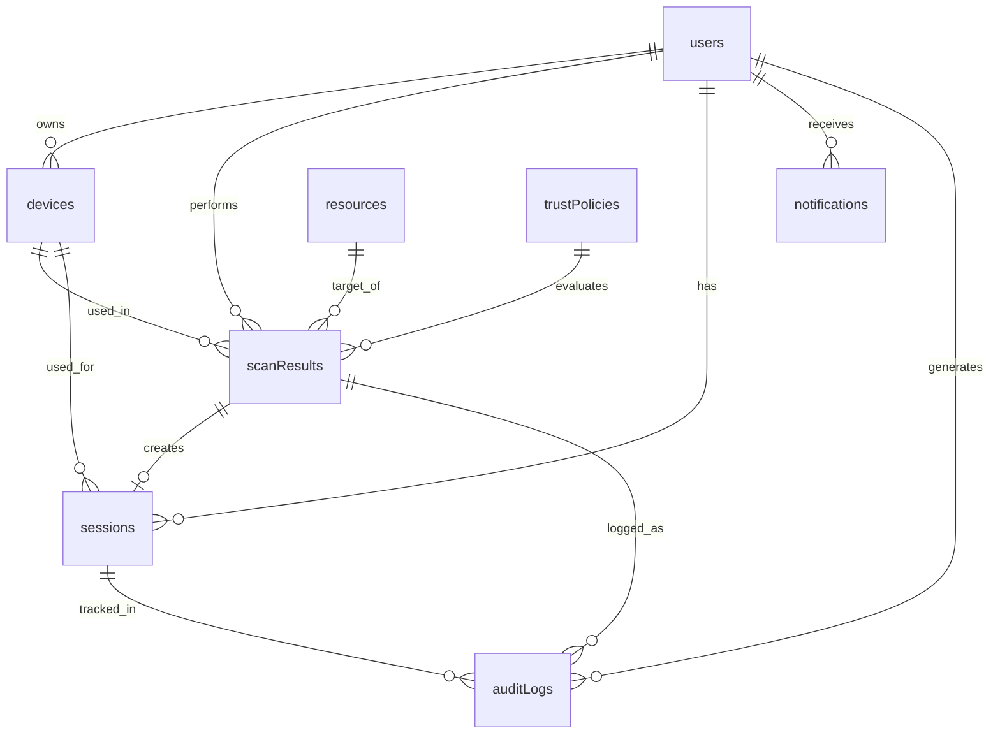

# SoraIAM MongoDB Schema Design

## Overview
This document defines the complete MongoDB schema for the SoraIAM Zero Trust Identity & Access Management platform. The schema is designed to support real-time trust evaluation, audit logging, MFA workflows, and comprehensive admin analytics.

---

## Collections

### 1. `users`
Stores user identity, role, and profile information.

```javascript
{
  _id: ObjectId,
  username: String,              // Unique username
  email: String,                 // Unique email
  passwordHash: String,          // Hashed password (bcrypt)
  role: String,                  // "employee" | "admin"
  firstName: String,
  lastName: String,
  department: String,            // Optional: Engineering, Sales, etc.
  status: String,                // "active" | "suspended" | "inactive"
  mfaEnabled: Boolean,           // Whether MFA is enabled
  mfaSecret: String,             // TOTP secret (encrypted)
  mfaBackupCodes: [String],      // Encrypted backup codes
  createdAt: Date,
  updatedAt: Date,
  lastLoginAt: Date,
  metadata: {
    employeeId: String,          // Optional: Corporate employee ID
    manager: ObjectId,           // Reference to manager's user _id
    location: String             // Primary work location
  }
}
```

**Indexes:**
- `{ username: 1 }` - unique
- `{ email: 1 }` - unique
- `{ role: 1, status: 1 }`
- `{ createdAt: -1 }`

---

### 2. `devices`
Tracks registered and detected devices per user.

```javascript
{
  _id: ObjectId,
  userId: ObjectId,              // Reference to users._id
  deviceId: String,              // Unique device fingerprint/UUID
  deviceType: String,            // "managed" | "personal"
  deviceName: String,            // User-friendly name
  platform: String,              // "Windows" | "macOS" | "Linux" | "iOS" | "Android"
  browser: String,               // "Chrome" | "Firefox" | "Safari" | "Edge"
  osVersion: String,
  browserVersion: String,
  isManaged: Boolean,            // Whether device is corporate-managed
  trustLevel: String,            // "trusted" | "unverified" | "compromised"
  lastSeenAt: Date,
  firstSeenAt: Date,
  ipAddress: String,             // Last known IP
  userAgent: String,             // Full user agent string
  deviceFingerprint: {           // Additional fingerprinting data
    screenResolution: String,
    timezone: String,
    language: String,
    plugins: [String]
  },
  complianceStatus: {
    antivirusEnabled: Boolean,
    diskEncrypted: Boolean,
    osUpToDate: Boolean,
    lastComplianceCheck: Date
  },
  createdAt: Date,
  updatedAt: Date
}
```

**Indexes:**
- `{ userId: 1, deviceId: 1 }` - unique compound
- `{ userId: 1, lastSeenAt: -1 }`
- `{ deviceType: 1, trustLevel: 1 }`
- `{ isManaged: 1 }`

---

### 3. `resources`
Defines protected resources with sensitivity levels.

```javascript
{
  _id: ObjectId,
  resourceId: String,            // Unique resource identifier
  name: String,                  // "Internal Web Dashboard"
  description: String,
  resourceType: String,          // "dashboard" | "repository" | "console" | "api"
  environment: String,           // "on-prem" | "cloud" | "hybrid"
  cloudProvider: String,         // "aws" | "azure" | "gcp" | null
  sensitivity: String,           // "standard" | "elevated" | "critical"
  sensitivityScore: Number,      // 1-10 multiplier for trust calculation
  requiredTrustScore: Number,    // Minimum trust score required (0-100)
  mfaRequired: Boolean,          // Force MFA regardless of trust score
  allowedRoles: [String],        // ["employee", "admin"] - who can access
  url: String,                   // Resource URL/endpoint
  tags: [String],                // ["production", "finance", "hr"]
  status: String,                // "active" | "maintenance" | "deprecated"
  createdAt: Date,
  updatedAt: Date,
  metadata: {
    owner: String,               // Team/department owner
    dataClassification: String,  // "public" | "internal" | "confidential" | "restricted"
    complianceRequirements: [String] // ["SOC2", "HIPAA", "GDPR"]
  }
}
```

**Indexes:**
- `{ resourceId: 1 }` - unique
- `{ sensitivity: 1, status: 1 }`
- `{ environment: 1 }`
- `{ allowedRoles: 1 }`

---

### 4. `scanResults`
Records every access verification attempt with full context.

```javascript
{
  _id: ObjectId,
  scanId: String,                // Unique scan identifier (UUID)
  userId: ObjectId,              // Reference to users._id
  deviceId: ObjectId,            // Reference to devices._id
  resourceId: ObjectId,          // Reference to resources._id
  
  // Trust Evaluation
  trustScore: Number,            // Final computed score (0-100)
  decision: String,              // "allow" | "mfa_required" | "blocked"
  decisionReason: String,        // Human-readable explanation
  
  // Context Information
  context: {
    deviceType: String,          // "managed" | "personal"
    networkType: String,         // "corporate" | "home" | "public"
    ipAddress: String,
    geolocation: {
      country: String,
      city: String,
      latitude: Number,
      longitude: Number
    },
    timestamp: Date,
    userAgent: String,
    sessionId: String            // Browser session identifier
  },
  
  // Decision Factors (detailed breakdown)
  factors: [
    {
      name: String,              // "Device Trust" | "Network Security" | "Resource Sensitivity"
      category: String,          // "device" | "network" | "resource" | "user" | "behavioral"
      status: String,            // "pass" | "warn" | "fail"
      score: Number,             // Individual factor score
      weight: Number,            // Weight in final calculation
      impact: Number,            // Contribution to final score
      details: String            // Additional context
    }
  ],
  
  // MFA Information
  mfaRequired: Boolean,
  mfaVerified: Boolean,
  mfaMethod: String,             // "totp" | "push" | "sms" | null
  mfaAttempts: Number,
  mfaVerifiedAt: Date,
  
  // Access Grant
  accessGranted: Boolean,
  accessGrantedAt: Date,
  accessDeniedReason: String,
  sessionDuration: Number,       // Expected session duration in seconds
  
  // Audit Trail
  createdAt: Date,
  updatedAt: Date,
  completedAt: Date,
  
  // Risk Indicators
  riskFlags: [String],           // ["unusual_location", "new_device", "off_hours"]
  anomalyScore: Number,          // 0-100, higher = more anomalous
  
  metadata: {
    scanDuration: Number,        // Time taken to complete scan (ms)
    retryCount: Number,          // Number of retry attempts
    policyVersion: String        // Version of trust policy applied
  }
}
```

**Indexes:**
- `{ scanId: 1 }` - unique
- `{ userId: 1, createdAt: -1 }`
- `{ resourceId: 1, createdAt: -1 }`
- `{ decision: 1, createdAt: -1 }`
- `{ accessGranted: 1, createdAt: -1 }`
- `{ context.ipAddress: 1 }`
- `{ createdAt: -1 }` - for time-series queries
- `{ userId: 1, deviceId: 1, createdAt: -1 }`

---

### 5. `sessions`
Manages active user sessions with re-verification tracking.

```javascript
{
  _id: ObjectId,
  sessionId: String,             // Unique session token (UUID)
  userId: ObjectId,              // Reference to users._id
  deviceId: ObjectId,            // Reference to devices._id
  scanId: ObjectId,              // Reference to initial scanResults._id
  
  status: String,                // "active" | "expired" | "revoked"
  trustScore: Number,            // Trust score at session creation
  
  // Session Lifecycle
  createdAt: Date,
  lastActivityAt: Date,
  expiresAt: Date,
  revokedAt: Date,
  revokedReason: String,
  
  // Re-verification
  requiresReverification: Boolean,
  lastVerificationAt: Date,
  verificationInterval: Number,  // Seconds between re-verifications
  
  // Session Context
  ipAddress: String,
  userAgent: String,
  
  // Access Tracking
  resourcesAccessed: [
    {
      resourceId: ObjectId,
      accessedAt: Date,
      trustScoreAtAccess: Number
    }
  ],
  
  metadata: {
    loginMethod: String,         // "password" | "sso" | "oauth"
    mfaUsed: Boolean,
    sessionType: String          // "web" | "api" | "mobile"
  }
}
```

**Indexes:**
- `{ sessionId: 1 }` - unique
- `{ userId: 1, status: 1, expiresAt: -1 }`
- `{ status: 1, expiresAt: 1 }` - for cleanup
- `{ lastActivityAt: -1 }`

---

### 6. `trustPolicies`
Configurable trust evaluation rules and thresholds.

```javascript
{
  _id: ObjectId,
  policyId: String,              // Unique policy identifier
  name: String,                  // "Default Trust Policy"
  description: String,
  version: String,               // Semantic versioning
  status: String,                // "active" | "draft" | "archived"
  
  // Trust Score Thresholds
  thresholds: {
    allowThreshold: Number,      // ≥ 70 default
    mfaThreshold: Number,        // 40-69 default
    blockThreshold: Number       // < 40 default
  },
  
  // Factor Weights (must sum to 100)
  factorWeights: {
    deviceTrust: Number,         // 30
    networkSecurity: Number,     // 25
    resourceSensitivity: Number, // 20
    userBehavior: Number,        // 15
    timeContext: Number,         // 10
  },
  
  // Device Scoring
  deviceScoring: {
    managed: Number,             // +40 points
    personal: Number,            // +10 points
    unverified: Number,          // -20 points
    compromised: Number          // -50 points
  },
  
  // Network Scoring
  networkScoring: {
    corporate: Number,           // +30 points
    home: Number,                // +15 points
    public: Number,              // -10 points
    vpn: Number                  // +20 points
  },
  
  // Resource Sensitivity Multipliers
  resourceMultipliers: {
    standard: Number,            // 1.0x
    elevated: Number,            // 1.3x
    critical: Number             // 1.5x
  },
  
  // Behavioral Rules
  behavioralRules: {
    newDevicePenalty: Number,    // -15 points
    unusualLocationPenalty: Number, // -10 points
    offHoursPenalty: Number,     // -5 points
    rapidAccessPenalty: Number   // -10 points
  },
  
  // MFA Requirements
  mfaRules: {
    alwaysRequireForCritical: Boolean,
    requireForNewDevice: Boolean,
    requireForUnusualLocation: Boolean,
    requireAfterDays: Number     // Force MFA after N days
  },
  
  // Applicable Scope
  appliesTo: {
    roles: [String],             // ["employee", "admin"]
    resources: [ObjectId],       // Specific resources or [] for all
    departments: [String]
  },
  
  createdAt: Date,
  updatedAt: Date,
  createdBy: ObjectId,           // Reference to users._id
  effectiveFrom: Date,
  effectiveUntil: Date
}
```

**Indexes:**
- `{ policyId: 1 }` - unique
- `{ status: 1, effectiveFrom: 1 }`
- `{ version: -1 }`

---

### 7. `auditLogs`
Comprehensive audit trail for compliance and security monitoring.

```javascript
{
  _id: ObjectId,
  eventId: String,               // Unique event identifier
  eventType: String,             // "access_attempt" | "mfa_verification" | "policy_change" | "user_created" | "session_revoked"
  eventCategory: String,         // "authentication" | "authorization" | "administration" | "security"
  severity: String,              // "info" | "warning" | "critical"
  
  // Actor Information
  actor: {
    userId: ObjectId,
    username: String,
    role: String,
    ipAddress: String
  },
  
  // Target Information
  target: {
    type: String,                // "user" | "resource" | "device" | "policy"
    id: ObjectId,
    name: String
  },
  
  // Event Details
  action: String,                // "login" | "access_granted" | "access_denied" | "mfa_failed"
  result: String,                // "success" | "failure"
  details: Object,               // Flexible event-specific data
  
  // Context
  context: {
    deviceId: ObjectId,
    sessionId: String,
    scanId: String,
    ipAddress: String,
    userAgent: String,
    geolocation: Object
  },
  
  // Metadata
  timestamp: Date,
  createdAt: Date,
  
  // Compliance
  complianceFlags: [String],     // ["SOC2", "HIPAA"]
  retentionUntil: Date           // For data retention policies
}
```

**Indexes:**
- `{ eventId: 1 }` - unique
- `{ eventType: 1, timestamp: -1 }`
- `{ actor.userId: 1, timestamp: -1 }`
- `{ target.id: 1, timestamp: -1 }`
- `{ severity: 1, timestamp: -1 }`
- `{ timestamp: -1 }` - for time-series queries
- `{ retentionUntil: 1 }` - for automated cleanup

---

### 8. `notifications`
User and admin notifications for security events.

```javascript
{
  _id: ObjectId,
  notificationId: String,
  userId: ObjectId,              // Recipient
  type: String,                  // "security_alert" | "access_denied" | "new_device" | "policy_update"
  priority: String,              // "low" | "medium" | "high" | "critical"
  
  title: String,
  message: String,
  
  // Related Entities
  relatedTo: {
    type: String,                // "scan" | "device" | "session"
    id: ObjectId
  },
  
  // Notification State
  status: String,                // "unread" | "read" | "dismissed"
  readAt: Date,
  dismissedAt: Date,
  
  // Delivery
  channels: [String],            // ["in_app", "email", "sms"]
  deliveryStatus: {
    email: String,               // "sent" | "failed" | "pending"
    sms: String,
    push: String
  },
  
  createdAt: Date,
  expiresAt: Date,
  
  metadata: {
    actionRequired: Boolean,
    actionUrl: String,
    actionLabel: String
  }
}
```

**Indexes:**
- `{ userId: 1, status: 1, createdAt: -1 }`
- `{ createdAt: -1 }`
- `{ expiresAt: 1 }` - for cleanup

---

### 9. `analytics`
Pre-aggregated analytics for dashboard performance.

```javascript
{
  _id: ObjectId,
  metricType: String,            // "daily_summary" | "user_summary" | "resource_summary"
  periodType: String,            // "hourly" | "daily" | "weekly" | "monthly"
  periodStart: Date,
  periodEnd: Date,
  
  // Scope
  scope: {
    type: String,                // "global" | "user" | "resource" | "department"
    id: ObjectId                 // null for global
  },
  
  // Metrics
  metrics: {
    totalScans: Number,
    allowedScans: Number,
    mfaRequiredScans: Number,
    blockedScans: Number,
    averageTrustScore: Number,
    uniqueUsers: Number,
    uniqueDevices: Number,
    uniqueResources: Number,
    
    // Breakdowns
    byDecision: {
      allow: Number,
      mfa_required: Number,
      blocked: Number
    },
    
    byDeviceType: {
      managed: Number,
      personal: Number
    },
    
    byNetworkType: {
      corporate: Number,
      home: Number,
      public: Number
    },
    
    byResourceSensitivity: {
      standard: Number,
      elevated: Number,
      critical: Number
    },
    
    // Trends
    trustScoreTrend: [
      {
        timestamp: Date,
        avgScore: Number
      }
    ]
  },
  
  createdAt: Date,
  computedAt: Date
}
```

**Indexes:**
- `{ metricType: 1, periodStart: -1 }`
- `{ scope.type: 1, scope.id: 1, periodStart: -1 }`
- `{ periodType: 1, periodStart: -1 }`

---

## Relationships



---

## Data Retention Policies

| Collection | Retention Period | Cleanup Strategy |
|------------|------------------|------------------|
| `users` | Indefinite | Soft delete (status: inactive) |
| `devices` | 90 days after last seen | Hard delete |
| `resources` | Indefinite | Soft delete (status: deprecated) |
| `scanResults` | 1 year | Archive to cold storage, then delete |
| `sessions` | 30 days after expiration | Hard delete |
| `trustPolicies` | Indefinite | Archive old versions |
| `auditLogs` | 7 years (compliance) | Archive to cold storage |
| `notifications` | 90 days | Hard delete |
| `analytics` | 2 years | Aggregate to higher periods |

---

## Security Considerations

### 1. Encryption
- **At Rest**: Enable MongoDB encryption at rest
- **In Transit**: TLS/SSL for all connections
- **Field-Level**: Encrypt sensitive fields:
  - `users.passwordHash`
  - `users.mfaSecret`
  - `users.mfaBackupCodes`
  - `sessions.sessionId`

### 2. Access Control
- Use MongoDB Role-Based Access Control (RBAC)
- Separate read/write roles for application services
- Admin-only access to `users`, `trustPolicies`, `auditLogs`

### 3. Data Validation
- Use MongoDB schema validation for all collections
- Enforce required fields and data types
- Validate enum values (role, status, decision, etc.)

### 4. Backup Strategy
- Automated daily backups
- Point-in-time recovery enabled
- Geo-redundant backup storage
- Regular restore testing

---

## Performance Optimization

### 1. Indexing Strategy
- All indexes defined above are critical for query performance
- Monitor slow queries and add covering indexes as needed
- Use compound indexes for common query patterns

### 2. Sharding Recommendations
For large-scale deployments:
- **scanResults**: Shard by `{ userId: 1, createdAt: 1 }`
- **auditLogs**: Shard by `{ timestamp: 1 }`
- **sessions**: Shard by `{ userId: 1 }`

### 3. Aggregation Pipelines
Pre-compute analytics using scheduled aggregation jobs:
- Hourly: Real-time metrics for dashboards
- Daily: User/resource summaries
- Weekly/Monthly: Trend analysis

### 4. Caching
- Cache frequently accessed data:
  - Active trust policies
  - Resource definitions
  - User profiles
- Use Redis/Memcached for session management

---

## Migration Scripts

### Initial Setup Script (Node.js + Mongoose)

```javascript
// db-setup.js
const mongoose = require('mongoose');

async function setupDatabase() {
  // Connect to MongoDB
  await mongoose.connect(process.env.MONGODB_URI);
  
  const db = mongoose.connection.db;
  
  // Create collections with validation
  await createUsersCollection(db);
  await createDevicesCollection(db);
  await createResourcesCollection(db);
  await createScanResultsCollection(db);
  await createSessionsCollection(db);
  await createTrustPoliciesCollection(db);
  await createAuditLogsCollection(db);
  await createNotificationsCollection(db);
  await createAnalyticsCollection(db);
  
  // Create indexes
  await createIndexes(db);
  
  // Seed initial data
  await seedDefaultData(db);
  
  console.log('Database setup complete!');
}

async function createUsersCollection(db) {
  await db.createCollection('users', {
    validator: {
      $jsonSchema: {
        bsonType: 'object',
        required: ['username', 'email', 'passwordHash', 'role', 'status'],
        properties: {
          username: { bsonType: 'string', minLength: 3 },
          email: { bsonType: 'string', pattern: '^[a-zA-Z0-9._%+-]+@[a-zA-Z0-9.-]+\\.[a-zA-Z]{2,}$' },
          role: { enum: ['employee', 'admin'] },
          status: { enum: ['active', 'suspended', 'inactive'] },
          mfaEnabled: { bsonType: 'bool' }
        }
      }
    }
  });
}

async function createIndexes(db) {
  // Users indexes
  await db.collection('users').createIndex({ username: 1 }, { unique: true });
  await db.collection('users').createIndex({ email: 1 }, { unique: true });
  await db.collection('users').createIndex({ role: 1, status: 1 });
  
  // Devices indexes
  await db.collection('devices').createIndex({ userId: 1, deviceId: 1 }, { unique: true });
  await db.collection('devices').createIndex({ userId: 1, lastSeenAt: -1 });
  
  // ScanResults indexes
  await db.collection('scanResults').createIndex({ scanId: 1 }, { unique: true });
  await db.collection('scanResults').createIndex({ userId: 1, createdAt: -1 });
  await db.collection('scanResults').createIndex({ resourceId: 1, createdAt: -1 });
  await db.collection('scanResults').createIndex({ decision: 1, createdAt: -1 });
  
  // Sessions indexes
  await db.collection('sessions').createIndex({ sessionId: 1 }, { unique: true });
  await db.collection('sessions').createIndex({ userId: 1, status: 1, expiresAt: -1 });
  
  // AuditLogs indexes
  await db.collection('auditLogs').createIndex({ eventId: 1 }, { unique: true });
  await db.collection('auditLogs').createIndex({ timestamp: -1 });
  await db.collection('auditLogs').createIndex({ 'actor.userId': 1, timestamp: -1 });
  
  console.log('Indexes created successfully');
}

async function seedDefaultData(db) {
  // Seed default trust policy
  await db.collection('trustPolicies').insertOne({
    policyId: 'default-v1',
    name: 'Default Trust Policy',
    version: '1.0.0',
    status: 'active',
    thresholds: {
      allowThreshold: 70,
      mfaThreshold: 40,
      blockThreshold: 40
    },
    factorWeights: {
      deviceTrust: 30,
      networkSecurity: 25,
      resourceSensitivity: 20,
      userBehavior: 15,
      timeContext: 10
    },
    deviceScoring: {
      managed: 40,
      personal: 10,
      unverified: -20,
      compromised: -50
    },
    networkScoring: {
      corporate: 30,
      home: 15,
      public: -10,
      vpn: 20
    },
    resourceMultipliers: {
      standard: 1.0,
      elevated: 1.3,
      critical: 1.5
    },
    createdAt: new Date(),
    updatedAt: new Date()
  });
  
  // Seed default resources
  const resources = [
    {
      resourceId: 'internal-dashboard',
      name: 'Internal Web Dashboard',
      resourceType: 'dashboard',
      environment: 'on-prem',
      sensitivity: 'standard',
      sensitivityScore: 3,
      requiredTrustScore: 60,
      mfaRequired: false,
      allowedRoles: ['employee', 'admin'],
      status: 'active',
      createdAt: new Date()
    },
    {
      resourceId: 'git-repository',
      name: 'Git Repository',
      resourceType: 'repository',
      environment: 'cloud',
      cloudProvider: 'aws',
      sensitivity: 'elevated',
      sensitivityScore: 7,
      requiredTrustScore: 70,
      mfaRequired: false,
      allowedRoles: ['employee', 'admin'],
      status: 'active',
      createdAt: new Date()
    },
    {
      resourceId: 'prod-console',
      name: 'Production Cloud Console',
      resourceType: 'console',
      environment: 'cloud',
      cloudProvider: 'aws',
      sensitivity: 'critical',
      sensitivityScore: 10,
      requiredTrustScore: 80,
      mfaRequired: true,
      allowedRoles: ['admin'],
      status: 'active',
      createdAt: new Date()
    }
  ];
  
  await db.collection('resources').insertMany(resources);
  
  console.log('Default data seeded successfully');
}

// Run setup
setupDatabase()
  .then(() => process.exit(0))
  .catch(err => {
    console.error('Setup failed:', err);
    process.exit(1);
  });
```

---

## API Integration Examples

### 1. Create Scan Result

```javascript
async function createScanResult(scanData) {
  const scanResult = {
    scanId: uuidv4(),
    userId: new ObjectId(scanData.userId),
    deviceId: new ObjectId(scanData.deviceId),
    resourceId: new ObjectId(scanData.resourceId),
    trustScore: scanData.trustScore,
    decision: scanData.decision,
    decisionReason: scanData.decisionReason,
    context: scanData.context,
    factors: scanData.factors,
    mfaRequired: scanData.mfaRequired,
    mfaVerified: scanData.mfaVerified || false,
    accessGranted: scanData.accessGranted,
    createdAt: new Date(),
    updatedAt: new Date()
  };
  
  const result = await db.collection('scanResults').insertOne(scanResult);
  
  // Create audit log
  await createAuditLog({
    eventType: 'access_attempt',
    eventCategory: 'authorization',
    severity: scanData.decision === 'blocked' ? 'warning' : 'info',
    actor: { userId: scanData.userId },
    target: { type: 'resource', id: scanData.resourceId },
    action: 'access_request',
    result: scanData.accessGranted ? 'success' : 'failure',
    context: { scanId: scanResult.scanId }
  });
  
  return result.insertedId;
}
```

### 2. Query User Scan History

```javascript
async function getUserScanHistory(userId, limit = 50) {
  return await db.collection('scanResults')
    .find({ userId: new ObjectId(userId) })
    .sort({ createdAt: -1 })
    .limit(limit)
    .toArray();
}
```

### 3. Get Admin Dashboard Stats

```javascript
async function getAdminDashboardStats(timeRange = 'today') {
  const startDate = getStartDate(timeRange);
  
  const stats = await db.collection('scanResults').aggregate([
    { $match: { createdAt: { $gte: startDate } } },
    {
      $group: {
        _id: null,
        totalScans: { $sum: 1 },
        allowedScans: {
          $sum: { $cond: [{ $eq: ['$decision', 'allow'] }, 1, 0] }
        },
        mfaRequiredScans: {
          $sum: { $cond: [{ $eq: ['$decision', 'mfa_required'] }, 1, 0] }
        },
        blockedScans: {
          $sum: { $cond: [{ $eq: ['$decision', 'blocked'] }, 1, 0] }
        },
        avgTrustScore: { $avg: '$trustScore' }
      }
    }
  ]).toArray();
  
  return stats[0] || {};
}
```

---

## Conclusion

This MongoDB schema provides a comprehensive foundation for the SoraIAM Zero Trust platform, supporting:

✅ Real-time trust evaluation with detailed factor tracking  
✅ Complete audit trail for compliance  
✅ Flexible policy management  
✅ High-performance analytics  
✅ Scalability for enterprise deployments  
✅ Security best practices built-in  

The schema is designed to be production-ready while remaining flexible for future enhancements outlined in the PRD.
